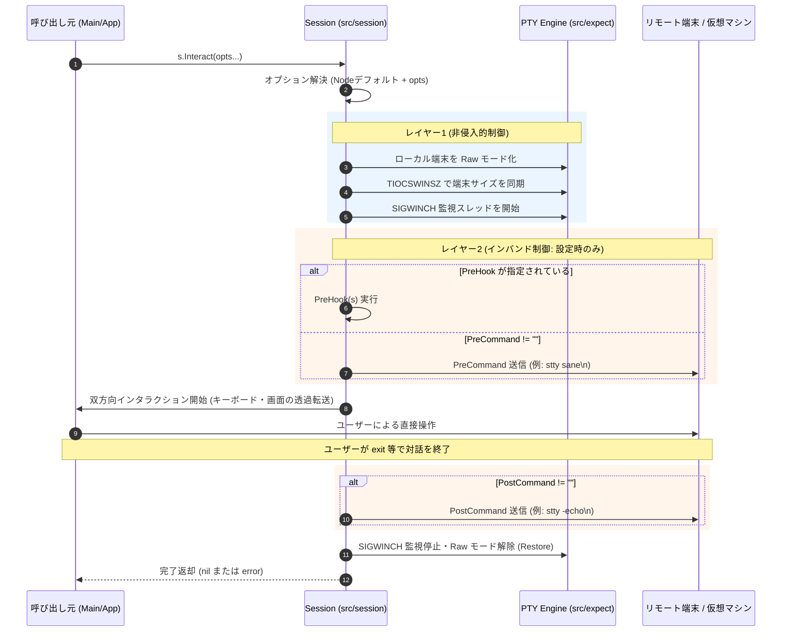

# 端末サイズ（Winsize）および端末リセット制御の設計仕様書

本書では、`goplur` において SSH 接続後の対話モード（`Interact`）や `session_wrap` による多段接続、シリアル端末（`virsh console` 等）において発生する「カーソルのズレ」「端末状態の乱れ」を防ぎ、かつ環境ごとに安全に制御を設定・カスタマイズできるようにするための設計仕様をまとめます。

---

## 1. 背景と課題

### 1.1 発生している現象
SSH 接続完了後に自動化から対話モード（`s.Interact()`）へ移行した際、以下のような表示崩れや入力のズレが発生することがあります：
- 長いコマンドを入力すると、画面端に達する前に変な位置で改行・折り返しされる。
- カーソル移動（矢印キーや Backspace）の際、カーソルの表示位置と実際の文字入力位置がズレる。
- ユーザーが手動で `reset` または `stty sane` コマンドを実行すると正常に戻る。

### 1.2 原因の分析
この現象は、主に以下の2つの独立した要因によって引き起こされます：

1. **PTY ウィンドウサイズ（Winsize）の不一致**
   - Expect の PTY Master/Slave は起動時にデフォルト値（80列×24行など、または未設定 0×0）で割り当てられます。
   - 一方で、ユーザーが操作している手元のターミナルエミュレータ（Alacritty, iTerm2, GNOME Terminal 等）は横幅 120〜200 桁など広くなっています。
   - リモート側の bash や readline は「端末幅 80 列」と認識したまま描画計算を行うため、80文字に達した時点で折り返しを描画してしまい、画面が崩れます。

2. **端末属性（termios）の自動化状態からの残存**
   - `goplur` では自動化中のコマンド重複表示（エコーバック）を防ぐために `stty -echo` を設定したり、特殊キーの解釈を制御しています。
   - また、多段ホップ時や直前のコマンド実行の影響で、端末モードが半端な状態（Cooked/Raw の不完全な状態）になっている場合があります。

### 1.3 なぜ「コードへの reset 埋め込み」ではいけないのか？
最も単純な対処法は `s.Interact()` の冒頭で自動的に `reset` や `stty sane` をリモートへ送信することです。
しかし、`goplur` の実運用環境を考慮すると、**これは重大な障害・副作用を引き起こします**。

- **`virsh console` やシリアルコンソールへの影響**:
  - `virsh console <vm>` やシリアルポート接続、ブートローダ（GRUB等）の対話画面では、シェル（bash）が動いていません。
  - その状態で `stty sane\n` や `reset\n` という文字列を送信すると、コンソール入力にゴミ文字列が注入され、ログインプロンプトが汚染されたり、起動シーケンスが中断されるなどの誤作動を引き起こします。
- **ネットワーク機器・アプライアンス（Cisco, Juniper 等）への影響**:
  - 独自 CLI を持つ機器では `stty` や `reset` は未定義コマンドとなり、Syntax Error を連発します。
- **多段ホップ（`session_wrap`）における複雑性**:
  - Host A (SSH) -> Host B (SSH) -> Guest (virsh console) と遷移する場合、あるステップでは `stty sane` が必要でも、次のステップでは絶対に送ってはならないという状況が発生します。

したがって、**「PTY層の制御（安全）」と「コマンド送信（環境依存）」を明確に分離し、都度設定できる柔軟なアーキテクチャ** が求められます。

---

## 2. 端末制御の2層分離モデル

端末制御を以下の2つのレイヤーに厳密に分離して設計します。

```
+-------------------------------------------------------------------------+
| レイヤー 1: PTY / OS レイヤー (非侵入的・100%安全・副作用なし)             |
|   - 端末サイズ通知 (ioctl TIOCSWINSZ)                                   |
|   - ウィンドウリサイズ追従 (SIGWINCH 転送)                              |
|   - ローカル端末の Raw モード化 (term.MakeRaw)                           |
|   * 特徴: リモートの入力ストリームに 1 バイトも文字を流さない。             |
|          virsh console、シリアル、ルータ、シェル等、相手を問わず安全。      |
+-------------------------------------------------------------------------+
                                    |
                                    v
+-------------------------------------------------------------------------+
| レイヤー 2: インバンド・ストリーム レイヤー (侵入的・相手の環境に強く依存)    |
|   - stty sane / reset / stty echo 等の文字列送信                         |
|   * 特徴: リモートが bash 等の通常のシェルである場合のみ有効。             |
|          コンソールや特殊CLIでは害になるため「完全オプトイン／切替可能」にする。|
+-------------------------------------------------------------------------+
```

---

## 3. 提案アーキテクチャの概要

本設計では、Go 言語で最も拡張性と保守性が高い以下の**多層ハイブリッド構成**を採用します。

```
+--------------------------------------------------------------------+
| 1. 呼び出し単位の動的制御: Functional Options Pattern               |
|    s.Interact(session.WithPreCommand("reset"))                     |
|    s.Interact(session.WithoutCommands())  <-- virsh console等       |
|    s.Interact(session.WithPreHook(fn))                             |
+---------------------------------+----------------------------------+
                                  | 未指定時のフォールバック
                                  v
+--------------------------------------------------------------------+
| 2. ノード単位の静的定義: Node インターフェース (s.CurrentNode())     |
|    - SshNode:     PreCommand = "stty echo; stty sane"              |
|    - BashNode:    PreCommand = "stty echo"                         |
|    - ConsoleNode: PreCommand = "" (何もしない)                      |
+---------------------------------+----------------------------------+
                                  | 解決された設定
                                  v
+--------------------------------------------------------------------+
| 3. Session / Expect 実行エンジン                                   |
|    (1) PTY Winsize & SIGWINCH 同期 (常に安全に実行)                 |
|    (2) PreHook / PreCommand 実行 (設定がある場合のみ)                |
|    (3) ユーザー双方向 Raw 入出力ループ                              |
|    (4) PostHook / PostCommand 実行 (設定がある場合のみ)            |
+------------------------------------+-------------------------------+
```

---

## 4. 詳細仕様設計

### 4.1 レイヤー 1: PTY レベルの Winsize 同期と動的リサイズ (`src/expect/interact.go`)

文字入力を介さずに、OS カーネルレベルで端末サイズを PTY に反映します。

#### ① 初回サイズ同期
ローカル端末（`os.Stdin`）のウィンドウサイズを取得し、子プロセスの PTY Master に対して `TIOCSWINSZ` ioctl を発行します。
これにより、リモートの SSH プロセスが起動元の端末サイズ（例: 140x40）を正しく認識します。

#### ② 対話中の `SIGWINCH` 追従
対話中にユーザーがターミナルウィンドウのサイズを変更した場合、OS から `SIGWINCH` シグナルが送信されます。
これをバックグラウンドで監視し、PTY Master に `TIOCSWINSZ` を再適用します。

```go
// 実装イメージ (expect/interact.go)
sigChan := make(chan os.Signal, 1)
signal.Notify(sigChan, syscall.SIGWINCH)
defer func() {
    signal.Stop(sigChan)
    close(sigChan)
}()

go func() {
    for range sigChan {
        if w, h, err := xterm.GetSize(fd); err == nil && e.pty != nil && e.pty.Master != nil {
            setWinsize(e.pty.Master, w, h)
        }
    }
}()
```

### 4.2 レイヤー 2: `Node` インターフェースの拡張 (`src/node/node.go`)

`Node` に端末対話時の事前準備・事後復元コマンドの宣言的プロパティを追加します。
`session_wrap` でノードがスタックされる（`s.PushNode` / `s.PopNode`）ため、常に現在接続中のコンテキスト（`s.CurrentNode()`）から適切なデフォルト値を取得できます。

```go
type Node interface {
    GetHostname() string
    GetUsername() string
    GetPassword() string
    GetPlatform() string
    GetWaitPrompt() string
    GetAccessIP() string
    GetExitCommand() string
    GetRootPassword() string
    
    // 対話モード用の端末制御コマンド
    GetInteractPreCommand() string  // 対話開始前に送信するコマンド (空文字なら送らない)
    GetInteractPostCommand() string // 対話終了後に復元するコマンド
}
```

#### 各ノード構造体でのデフォルト値
- **`BaseNode` / `SshNode`**:
  ```go
  type SshNode struct {
      BaseNode
      SSHPort             int    `json:"ssh_port"`
      SSHOptions          string `json:"ssh_options"`
      InteractPreCommand  string `json:"interact_pre_command"`  // JSONから設定可能
      InteractPostCommand string `json:"interact_post_command"`
  }
  
  func (n *SshNode) GetInteractPreCommand() string {
      if n.InteractPreCommand != "" {
          return n.InteractPreCommand
      }
      return "stty echo; stty sane" // SSH通常シェル向けの安全なデフォルト
  }
  ```
- **`ConsoleNode` / `VirshNode` / `SerialNode`（新規想定）**:
  - `GetInteractPreCommand()` は空文字列 `""` を返す。
  - 文字列送信を一切行わず、PTY の Raw 通信のみに徹する。

### 4.3 レイヤー 3: `Session.Interact` の Functional Options (`src/session/interact.go`)

呼び出し元の文脈（「今は一時的に `reset` を叩きたい」「ここは `virsh console` なので何も送らない」など）で都度オーバーライドできるようにします。

```go
type InteractConfig struct {
    PreCommand  *string                // 送信する事前コマンド (nilならNodeのデフォルト値を使用)
    PostCommand *string                // 送信する事後コマンド (nilならNodeのデフォルト値を使用)
    PreHook     func(s *Session) error // コマンド送信前の独自フック (プロンプト待ち等)
    PostHook    func(s *Session) error // 対話終了後の独自フック
    SyncWinsize bool                   // PTYサイズ同期を行うか (デフォルト true)
}

type InteractOption func(*InteractConfig)

// 指定したコマンドを事前送信する
func WithPreCommand(cmd string) InteractOption {
    return func(c *InteractConfig) {
        c.PreCommand = &cmd
    }
}

// コマンド送信を完全に無効化する (virsh console, シリアルコンソール等)
func WithoutCommands() InteractOption {
    empty := ""
    return func(c *InteractConfig) {
        c.PreCommand = &empty
        c.PostCommand = &empty
    }
}

// 対話突入前に任意のカスタム処理（プロンプト待ちや特殊エスケープシーケンス）を行う
func WithPreHook(fn func(s *Session) error) InteractOption {
    return func(c *InteractConfig) {
        c.PreHook = fn
    }
}
```

### 4.4 実行シーケンスフロー

`s.Interact(opts...)` が呼び出された時の内部処理フローは以下の通りです：



---

## 5. ユースケース別の適用例

### ユースケース 1: 通常の SSH 接続（デフォルト動作）
何もしなくても `SshNode` のデフォルト設定（PTY Winsize 同期 + `stty echo; stty sane`）が適用されます。
```go
// 余分な引数なし。カーソルのズレは防止される
err := s.Interact()
```

### ユースケース 2: `virsh console` やシリアルコンソールへの接続
シェルが動いていないため、コマンド送信を完全に抑止し、純粋な Raw 通信と PTY サイズ同期のみを行います。
```go
// "stty sane" などのコマンド送信を完全バイパス
err := s.Interact(session.WithoutCommands())
```

### ユースケース 3: 多段 SSH で特定ホストへ突入した際の一時的リセット
深い階層のホストで端末が崩れており、その呼び出し時のみ明示的に `reset` を発行したい場合：
```go
err := s.Interact(session.WithPreCommand("reset"))
```

### ユースケース 4: コマンド送信後にプロンプト復帰を待ってから画面を渡す場合
`reset` や `stty sane` を送った直後のゴミ出力をユーザーに見せたくない場合や、プロンプトが戻ったことを確認してからユーザーに操作権限を渡したい場合：
```go
err := s.Interact(session.WithPreHook(func(sess *session.Session) error {
    // リモートシェルでリセットを実行し、プロンプトが返ってくるのを待機
    _, err := sess.Run("stty sane")
    return err
}))
```

---

## 6. メリットまとめ

| 項目 | ハードコード方式 | 提案アーキテクチャ（本設計） |
| :--- | :--- | :--- |
| **カーソル位置ズレ防止** | △ `reset` を送れば直るが副作用大 | ◎ PTY ioctl（カーネル層）で安全に解決 |
| **`virsh console` 対応** | × コマンドがゴミとして入力され誤動作 | ◎ `WithoutCommands()` により完全安全 |
| **多段 SSH / `session_wrap`** | × 途中ステップで一律にコマンドが走る | ◎ `CurrentNode()` とオプションで個別制御 |
| **後方互換性** | — | ◎ 既存の `s.Interact()` は引数なしでそのまま動作 |
| **拡張性** | × 別の特殊端末が現れるたびに `if` 文が増える | ◎ 新しい `Node` 定義やオプション追加で即応可能 |

---

## 7. 実装計画と対応状況

本仕様に基づく実装はすべて完了しています：

- [x] **`src/expect/interact.go`**:
  - `SIGWINCH` シグナルハンドラおよび監視 goroutine を追加し、対話中の動的リサイズ追従を実装。
- [x] **`src/node/node.go`**:
  - `Node` インターフェースに `GetInteractPreCommand()` / `GetInteractPostCommand()` を追加。
  - `BaseNode`, `BashNode`, `SshNode` に実装（各環境向けのデフォルト値付与と JSON フィールドバインド）。
- [x] **`src/session/interact.go`**:
  - `InteractOption`, `InteractConfig`、およびヘルパー群（`WithPreCommand`, `WithoutCommands`, `WithPreHook`, `WithPostHook`, `WithWinsizeSync` 等）を実装。
  - `Session.Interact` がノード設定とオプションを順次解決して実行するようリファクタリング。
- [x] **ルートパッケージ (`goplur.go`)**:
  - ユーザー向けに `goplur.WithPreCommand` などのオプションヘルパーおよび `goplur.Interact(s, opts...)` を再エクスポート。
- [x] **テストと検証**:
  - `src/session/interact_test.go` に設定解決、オプション上書き、`WithoutCommands()` のユニットテストを追加。
  - `goplur_test.go` に再エクスポートされたインターフェースの型チェックテストを追加。
  - `go test -count=1 ./...` ですべてのテストがパスすることを確認。

---

## 8. 実装結果と検証 (Implementation Results & Verification)

### 8.1 実装ファイル一覧と変更詳細

#### ① `src/expect/interact.go` (PTY 動的リサイズ追従)
`xterm.MakeRaw(fd)` によるローカル端末の Raw モード化および初回の `setWinsize(e.pty.Master, w, h)` に加え、バックグラウンドで `SIGWINCH` を受信する goroutine を実装しました。対話終了時には `defer close(sigDone)` で安全にリソースを解放します。

```go
// SIGWINCH 監視と動的サイズ同期
sigChan := make(chan os.Signal, 1)
sigDone := make(chan struct{})
signal.Notify(sigChan, syscall.SIGWINCH)
defer func() {
    signal.Stop(sigChan)
    close(sigDone)
}()

go func() {
    for {
        select {
        case <-sigDone:
            return
        case <-sigChan:
            if w, h, err := xterm.GetSize(fd); err == nil && e.pty != nil && e.pty.Master != nil {
                setWinsize(e.pty.Master, w, h)
            }
        }
    }
}()
```

#### ② `src/node/node.go` (`Node` インターフェースと各ノードのデフォルト値)
ノード単位で対話開始前および終了後のコマンドを宣言できるようにしました。

```go
type Node interface {
    // ...
    GetInteractPreCommand() string
    GetInteractPostCommand() string
}
```

- **`SshNode`**:
  - `InteractPreCommand`: 未設定時デフォルトは `"stty echo; stty sane"`
  - `InteractPostCommand`: 未設定時デフォルトは `"stty -echo"`
- **`BashNode`**:
  - `InteractPreCommand`: 未設定時デフォルトは `"stty echo"`
  - `InteractPostCommand`: 未設定時デフォルトは `"stty -echo"`
- **`BaseNode` / シリアルコンソール等**:
  - フィールドに値が明示されていない限り空文字列 `""` を返し、不要なコマンド送信を発生させない。

#### ③ `src/session/interact.go` (Functional Options パターン)
呼び出し単位でノードのデフォルト値をオーバーライドできるよう、Go の慣用的なオプションパターンを導入しました。

```go
func (s *Session) Interact(opts ...InteractOption) error {
    return s.InteractWithIO(os.Stdin, os.Stdout, opts...)
}

func (s *Session) InteractWithIO(in io.Reader, out io.Writer, opts ...InteractOption) error {
    if s.child == nil {
        return fmt.Errorf("interact: no active session process")
    }

    cfg := s.resolveInteractConfig(opts...)

    // PreHook または PreCommand の実行
    if cfg.PreHook != nil {
        if err := cfg.PreHook(s); err != nil {
            return err
        }
    } else if cfg.PreCommand != nil && *cfg.PreCommand != "" {
        _ = s.child.Send(*cfg.PreCommand + "\n")
    }

    s.logger.outputWriter.Unmute()
    err := s.child.InteractWithIO(in, out)

    // PostHook または PostCommand の実行
    if s.child.IsAlive() {
        if cfg.PostHook != nil {
            _ = cfg.PostHook(s)
        } else if cfg.PostCommand != nil && *cfg.PostCommand != "" {
            _ = s.child.Send(*cfg.PostCommand + "\n")
        }
    }
    return err
}
```

#### ④ ルートパッケージ `goplur.go`
ライブラリ利用者が内部パッケージ（`src/session`）を意識せずに直感的に利用できるように再エクスポートを行いました。
- `type InteractOption = session.InteractOption`
- `type InteractConfig = session.InteractConfig`
- `WithPreCommand`, `WithPostCommand`, `WithoutCommands`, `WithPreHook`, `WithPostHook`, `WithWinsizeSync`
- `Interact(s *Session, opts ...InteractOption) error`

---

### 8.2 テストと検証結果

#### 単体テストの内容
- `src/session/interact_test.go`:
  - `TestResolveInteractConfig_Defaults`: `SshNode`, `BashNode`, `BaseNode` それぞれのデフォルト事前・事後コマンド解決を検証。
  - `TestResolveInteractConfig_OptionsOverride`: `WithPreCommand("reset")` や `WithoutCommands()`、`WithPreHook` による上書きを検証。
  - `TestSessionInteract_WithWithoutCommands`: コマンド送信を行わずに Raw モードと事前フックが正常に動作することを検証。
- `goplur_test.go`:
  - `TestReExportInteract`: ルートパッケージからの再エクスポートシグネチャの整合性を検証。

#### テスト実行結果ログ
```console
$ go test -count=1 ./...
ok      goplur                  0.840s
ok      goplur/src/expect       0.159s
?       goplur/src/node         [no test files]
ok      goplur/src/session      0.726s
ok      goplur/src/tool         0.002s
```
全パッケージにおいてリグレッションなく、すべてのテストがパスすることを確認しました。

---

### 8.3 動作確認例と使用ガイド

```go
package main

import (
    "log"
    "goplur"
)

func main() {
    // 1. ノードの作成
    sshNode := goplur.NewSshNode("web01", "192.168.1.50", "admin", "secret", "almalinux9")

    lp := goplur.DefaultLogParams()
    s := goplur.NewSession(sshNode, &lp)
    defer s.Close()

    if _, err := s.Ssh(); err != nil {
        log.Fatalf("SSH login failed: %v", err)
    }

    // パターンA: 通常の対話（自動で PTY リサイズ + stty sane が適用され、カーソルズレを防止）
    _ = s.Interact()

    // パターンB: virsh console やシリアルコンソール等への突入時（コマンド送信を完全停止）
    // _ = s.Interact(goplur.WithoutCommands())

    // パターンC: 特定ホストで明示的に reset を実行したい場合
    // _ = s.Interact(goplur.WithPreCommand("reset"))
}
```
