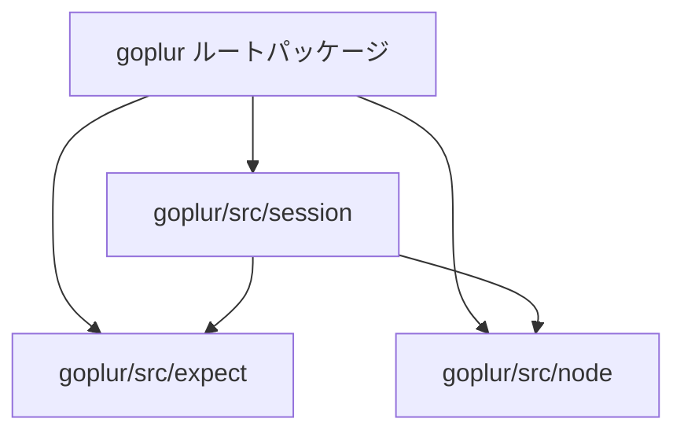

# コードのディレクトリ再構成（src化）の計画

プロジェクトルートに混在している `.go` ファイルを `src` フォルダ以下に機能別にグループ化し、外部ユーザーからのインポート方法や使用方法を変更せずに維持する（後方互換性の確保）ための計画です。

---

## 1. 目的と再構成デザイン

### 目的
- 現在ルートディレクトリにすべてのソースコードファイルが置かれているため、機能ごとのメンテナンス性が悪く、また `history` や `example` などのドキュメント/サンプル用フォルダとの区別がつきにくくなっています。
- これらを `src` フォルダの下に機能別のサブパッケージとして整理します。
- 一方で、外部ライブラリとしての利用者がコードの書き換えを一切行わずに移行できるように、ルートパッケージは「ファサード（窓口）」として機能させ、サブパッケージの型や関数を再エクスポートします。

### ディレクトリ構成案

```
goplur (ルート)
├── go.mod
├── go.sum
├── goplur.go             <-- [NEW] サブパッケージを再エクスポートするファサードファイル
├── goplur_test.go        <-- ルートパッケージに対する外部テスト
├── example/              <-- サンプルコード群（変更なし）
├── history/              <-- 設計ドキュメント履歴（変更なし）
└── src/                  <-- [NEW] 実装コードを配置
    ├── expect/           <-- [NEW] goexpectエンジン
    │   ├── expect.go     <-- (旧 goexpect.go)
    │   └── expect_test.go<-- (旧 goexpect_test.go)
    ├── node/             <-- [NEW] Nodeモデル定義
    │   └── node.go       <-- (旧 node.go)
    └── session/          <-- [NEW] セッション管理とシェル操作・ロギング
        ├── session.go    <-- (旧 session.go)
        ├── session_wrap.go<-- (旧 session_wrap.go)
        ├── shell.go      <-- (旧 shell.go)
        └── logger.go     <-- (旧 logger.go)
```

---

## 2. 依存関係の整理と循環参照の回避

Go言語ではパッケージ間の循環参照（A -> B -> A）が禁止されているため、以下の通り依存関係を階層化します。



- `expect` パッケージ: 他の内部パッケージに一切依存しない（独立）。
- `node` パッケージ: 他の内部パッケージに一切依存しない（独立）。
- `session` パッケージ: `expect` および `node` パッケージに依存します。また、ロギング機能（`logger.go`）は `session` と深く相互参照しているため、循環参照を防ぐために同一の `session` パッケージ（`src/session` ディレクトリ内）に含めます。

---

## 3. ユーザーレビューが必要な点（User Review Required）
> [!IMPORTANT]
> - ルートパッケージの `goplur.go` がサブパッケージのエイリアス定義を提供するため、外部利用者はこれまで通り `goplur` パッケージをインポートしてすべての機能を利用可能です（API破壊はありません）。
> - インライン化された `goexpect` に関するテスト（`goexpect_test.go`）は `src/expect/expect_test.go` へ移動し、`package expect` としてテストを行います。

---

## 4. オープンな質問（Open Questions）
特にありません。

---

## 5. 予定される変更詳細

### 1. 新規作成: `goplur.go` (ルートファサード)
ルートパッケージ `goplur` で `src/` 以下の型・定数・関数を再エクスポートします。

```go
package goplur

import (
	"goplur/src/expect"
	"goplur/src/node"
	"goplur/src/session"
)

// 型エイリアス定義
type Node = node.Node
type BaseNode = node.BaseNode
type BashNode = node.BashNode
type SshNode = node.SshNode
type TelnetNode = node.TelnetNode

type Session = session.Session
type LogParams = session.LogParams
type ExpectRow = session.ExpectRow
type ReactionType = session.ReactionType
type SessionLogger = session.SessionLogger
type DebugLogger = session.DebugLogger

type GExpect = expect.GExpect
type Caser = expect.Caser
type Case = expect.Case
type Tag = expect.Tag

// 定数の再エクスポート
const (
	ReactionSuccess     = session.ReactionSuccess
	ReactionSend        = session.ReactionSend
	ReactionSendLine    = session.ReactionSendLine
	ReactionSendPass    = session.ReactionSendPass
	ReactionGetPass     = session.ReactionGetPass
	ReactionSendControl = session.ReactionSendControl
	ReactionExit        = session.ReactionExit
)

const (
	OKTag = expect.OKTag
	NoTag = expect.NoTag
)

const DefaultTimeout = expect.DefaultTimeout

// 関数の再エクスポート
func NewMeNode() *node.BashNode { return node.NewMeNode() }
func NewSshNode(h, a, u, p, pl string) *node.SshNode { return node.NewSshNode(h, a, u, p, pl) }
func NewTelnetNode(h, a, u, p, pl string) *node.TelnetNode { return node.NewTelnetNode(h, a, u, p, pl) }

func NewSession(n Node, l *LogParams) *Session { return session.NewSession(n, l) }
func RunBash(n Node, l *LogParams, fn func(s *Session) error) error { return session.RunBash(n, l, fn) }
func RunSsh(n Node, l *LogParams, fn func(s *Session) error) error { return session.RunSsh(n, l, fn) }
func RunTelnet(n Node, l *LogParams, fn func(s *Session) error) error { return session.RunTelnet(n, l, fn) }
func Sudo(s *Session, fn func(s *Session) error) error { return session.Sudo(s, fn) }
func Su(s *Session, u, p string, fn func(s *Session) error) error { return session.Su(s, u, p, fn) }
func SelectLogParams(env string) LogParams { return session.SelectLogParams(env) }

func OK() func() (Tag, error) { return expect.OK() }
```

### 2. ファイル移動とリファクタリング
#### [NEW] `src/expect/expect.go`
(旧 `goexpect.go`)
- `package expect` に変更します。

#### [NEW] `src/expect/expect_test.go`
(旧 `goexpect_test.go`)
- `package expect` に変更します。

#### [NEW] `src/node/node.go`
(旧 `node.go`)
- `package node` に変更します。

#### [NEW] `src/session/logger.go`
(旧 `logger.go`)
- `package session` に変更します。

#### [NEW] `src/session/session.go`
(旧 `session.go`)
- `package session` に変更します。
- `goplur/src/node` と `goplur/src/expect` をインポートします（インポート時の名前競合を避けるため、`nd "goplur/src/node"` / `exp "goplur/src/expect"` と別名を付けるのが安全です）。
- コード内の型参照を `nd.Node`, `exp.GExpect`, `exp.Caser`, `exp.Case`, `exp.OK()` などに変更します。

#### [NEW] `src/session/session_wrap.go`
(旧 `session_wrap.go`)
- `package session` に変更します。
- 同様に `goplur/src/node` を `nd` としてインポートし、`nd.Node` に置き換えます。

#### [NEW] `src/session/shell.go`
(旧 `shell.go`)
- `package session` に変更します。

#### [DELETE] 旧ファイル群
- `goexpect.go`
- `goexpect_test.go`
- `node.go`
- `logger.go`
- `session.go`
- `session_wrap.go`
- `shell.go`

---

## 6. リファクタリングおよび再構成完了のまとめ（Walkthrough）

外部ライブラリ依存関係の排除、サンプルの対話化、およびソースファイルを `src` 以下に再構成してモジュール設計を整理する一連の作業がすべて完了しました。

---

### 実施した変更内容

#### 1. ディレクトリの再構成（src化）
ルートディレクトリに配置されていた実装ファイルを `src` 以下の機能別サブパッケージに移動・再配置しました。

- **`src/expect/`**: 対話型マッチングエンジン（旧 `goexpect.go`、`goexpect_test.go`）
- **`src/node/`**: 接続ノードモデル（旧 `node.go`）
- **`src/session/`**: セッション制御、ロギング、および冪等操作コマンド（旧 `session.go`、`session_wrap.go`、`shell.go`、`logger.go`）
  - ※循環参照を避けるため、密に結合している `logger.go` とセッション系ロジックは同一の `session` パッケージにまとめました。

#### 2. ファサードファイル `goplur.go` ([goplur.go](file:///home/worker/Documents/antigravity/goplur/goplur.go)) の作成
- 外部の利用者がコードを一切書き換えることなく移行できるように、ルートディレクトリにエイリアス（再エクスポート）を定義する `goplur.go` を配置しました。
- `goplur.Node` や `goplur.RunBash` などの公開APIは完全に維持されます（後方互換性の保証）。

#### 3. 旧ファイル群の削除
重複を避けるため、ルートフォルダの古いファイルを削除しました。
（`node.go`, `goexpect.go`, `goexpect_test.go`, `logger.go`, `session.go`, `session_wrap.go`, `shell.go`）

---

### 検証結果

#### 1. 自動テスト
`go test -v ./...` を実行し、新しくグループ化されたパッケージテストおよびルートのファサード経由の結合テストがすべて正常にパスすることを確認しました。

```
=== RUN   TestNode
    goplur_test.go:17: Hostname: resolute, Username: worker, Platform: ubuntu resolute, WaitPrompt: worker@resolute..+\$ 
--- PASS: TestNode (0.00s)
=== RUN   TestBashSession
--- PASS: TestBashSession (0.19s)
=== RUN   TestShellOperations
--- PASS: TestShellOperations (0.18s)
=== RUN   TestSessionWrap
--- PASS: TestSessionWrap (0.18s)
=== RUN   TestNewNodeTypes
--- PASS: TestNewNodeTypes (0.00s)
PASS
ok  	goplur	0.556s
=== RUN   TestLocalSpawnEcho
--- PASS: TestLocalSpawnEcho (0.00s)
=== RUN   TestLocalExpectTimeout
--- PASS: TestLocalExpectTimeout (0.05s)
=== RUN   TestLocalExpectSwitchCase
--- PASS: TestLocalExpectSwitchCase (0.00s)
PASS
ok  	goplur/src/expect	0.058s
```

#### 2. クライアントコードのビルド確認
`example/bash.go` および `example/ssh.go` が、コードの変更なしで正常にビルド・実行できることを確認しました。
```bash
go build example/bash.go && go build example/ssh.go
```
後方互換性が完全に保たれていることが検証されました。
